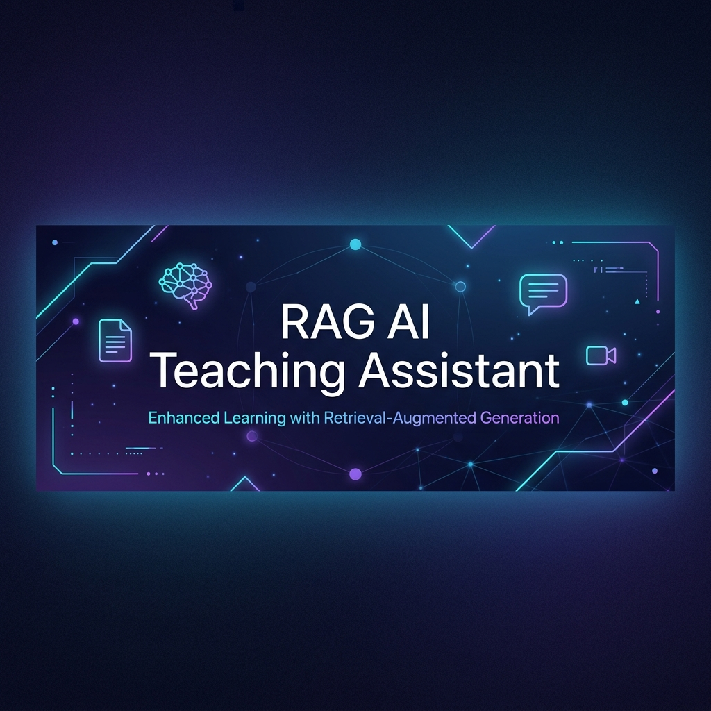
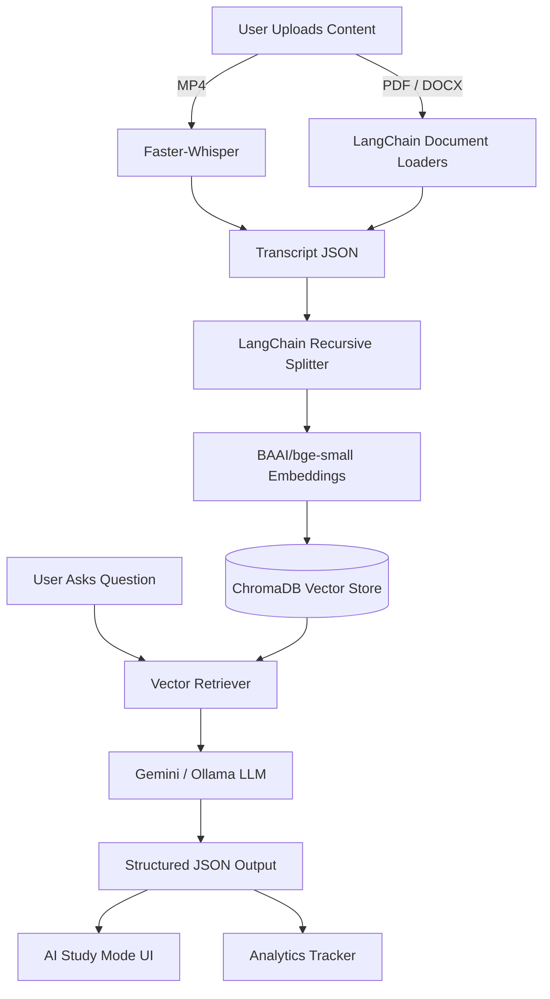

<div align="center">
  
  
  <h1 align="center" style="font-size: 3em; font-weight: 800; letter-spacing: -1px;">LearnLens AI</h1>
  
  <p align="center" style="font-size: 1.2em; color: #666;">
    <em>Turn Any Educational Content Into Your Personal AI Tutor</em>
  </p>
  <br/>

  <p align="center">
    <b>Python 3.9+</b> &nbsp;|&nbsp; 
    <b>LangChain</b> &nbsp;|&nbsp; 
    <b>Gradio UI</b> &nbsp;|&nbsp; 
    <b>Gemini API</b> &nbsp;|&nbsp; 
    <b>BGE-M3 Embeddings</b>
  </p>

  <p align="center">
    <a href="https://github.com/MakwanaOm1615/LearnLens-AI-Community-Edition">GitHub</a> •
    <a href="https://huggingface.co/spaces/Omverse/rag-ai-assistant">Live Demo</a> •
    <a href="https://www.linkedin.com/in/om-makwana-490aa7239/">LinkedIn</a>
  </p>
</div>

---

## 🌟 Project Overview

**LearnLens AI (Version 1 - Community Edition)** is a production-quality open-source AI learning platform. Instead of chatting with a hardcoded document, LearnLens AI allows anyone to upload their own educational content—whether it's an MP4 Video Lecture, a PDF Textbook, a DOCX Study Guide, or a Text Transcript—and instantly transforms it into a highly intelligent, interactive AI Tutor.

It leverages a powerful modular architecture built on **LangChain**, **Faster Whisper**, and **ChromaDB** to enable semantic search, smart timeline navigation, and automated learning tools (like flashcards and quizzes).

## ✨ Features

- **Multi-Format Ingestion:** Seamlessly upload `.mp4`, `.pdf`, `.docx`, and `.txt` files.
- **Smart Video Timeline:** Ask a question, and the AI generates a clickable timeline that seeks your video player to the exact second the topic was discussed.
- **AI Study Mode:** The chat interface outputs highly structured responses including the main answer, key concepts, related study topics, and practice questions.
- **Automated Learning Tools:** Instantly generate Chapter Summaries, 5-Question Quizzes, and Revision Notes from your content.
- **Learning Analytics Dashboard:** Automatically tracks the concepts you ask about most frequently and visualizes your strong/weak areas.
- **Modular Architecture:** Built with clean, abstracted layers making it incredibly easy to swap out LLMs (e.g., Gemini to Ollama) or Vector Stores (e.g., ChromaDB to FAISS).

## 🏗️ Architecture Diagram



## 📂 Folder Structure

The project is strictly organized by responsibility:

```text
LearnLens-AI/
├── app.py                      # Main Gradio application and UI orchestrator
├── deploy.py                   # Script to push architecture to Hugging Face Spaces
├── requirements.txt            # Python dependencies
├── models/
│   ├── data_models.py          # Pydantic/Dataclass structures for Chunks, Courses
│   └── analytics_models.py     # Models for tracking student learning progress
├── processors/
│   ├── content_ingestion.py    # Handles file saving and validation
│   ├── transcript_generator.py # Whisper/LangChain extraction logic
│   ├── chunker.py              # Semantic text splitting with timestamp mapping
│   ├── retriever.py            # Vector similarity search logic
│   ├── generator.py            # LLM Prompting and structured JSON generation
│   ├── ai_tools.py             # Quiz, Notes, and Flashcard generation
│   └── analytics_tracker.py    # Intercepts LLM concepts for the dashboard
├── providers/
│   ├── embedding_provider.py   # Abstract Base Class & BAAI Implementation
│   ├── llm_provider.py         # Abstract Base Class & Gemini/Ollama Implementation
│   └── vector_store_provider.py# Abstract Base Class & ChromaDB Implementation
├── storage/
│   ├── course_library.py       # Manages local course metadata JSON
│   └── analytics_storage.py    # Manages user progress JSON
└── ui/
    ├── study_dashboard.py      # Gradio logic for the Analytics Dashboard
    └── timeline_components.py  # JavaScript/HTML logic for the Video Player Timeline
```

## 🚀 Installation & Usage

### 💻 Local Deployment
1. **Clone the repository:**
   ```bash
   git clone https://github.com/MakwanaOm1615/LearnLens-AI-Community-Edition.git
   cd LearnLens-AI-Community-Edition
   ```

2. **Install dependencies:**
   ```bash
   pip install -r requirements.txt
   ```

3. **Set up Environment Variables:**
   Create a `.env` file in the root directory and add your Google Gemini API Key:
   ```env
   GOOGLE_API_KEY=your_api_key_here
   ```

4. **Run the Application:**
   ```bash
   python app.py
   ```
   *The terminal will output a local URL (e.g., `http://127.0.0.1:7860`). Open it in your browser.*

### ☁️ Hugging Face Spaces Deployment
LearnLens AI is architecture-ready for Hugging Face Spaces. It automatically detects the environment and ensures the custom fallback parser guarantees beautifully formatted markdown output.

1. **Create a Space** on Hugging Face (Gradio SDK).
2. **Push the code** using the included auto-deployer script:
   ```bash
   python deploy.py
   ```
3. **Set your Secrets** in the Space settings: Add `GOOGLE_API_KEY` to enable the AI engine on the cloud.

## 🧠 Technology Stack

- **Frontend:** Gradio (with custom CSS and HTML/JS embedding)
- **Backend Framework:** Python 3.9+, LangChain
- **Transcription (Offline):** Faster-Whisper
- **Vector Database:** ChromaDB
- **Embedding Model:** BAAI/bge-small-en-v1.5 (Sentence Transformers)
- **LLM Engine:** Google Gemini (Fallback support for local Ollama)

## 🗺️ Future Roadmap

- [ ] Support for YouTube URL Ingestion (via `yt-dlp`).
- [ ] Export Revision Notes to downloadable PDF.
- [ ] Multi-user authentication for personalized dashboards.
- [ ] Voice-to-Voice real-time tutoring mode.

## 🤝 Contributing

Contributions are welcome! If you'd like to improve LearnLens AI:
1. Fork the project
2. Create your Feature Branch (`git checkout -b feature/AmazingFeature`)
3. Commit your Changes (`git commit -m 'Add some AmazingFeature'`)
4. Push to the Branch (`git push origin feature/AmazingFeature`)
5. Open a Pull Request

## 📄 License

This project is licensed under the MIT License. See the `LICENSE` file for details.

## 👨‍💻 Author

**Built with ❤️ by Om Makwana**
- GitHub: [@MakwanaOm1615](https://github.com/MakwanaOm1615)
- LinkedIn: [Om Makwana](https://www.linkedin.com/in/om-makwana-490aa7239/)
